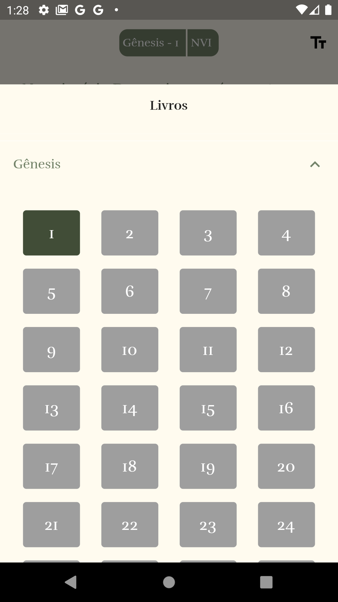

# MyBible

Este projeto tem o objetivo de democratizar o acesso à Bíblia Sagrada em português brasileiro para pessoas interessadas em proclamar o Evangelho e as boas-novas do Reino de Deus.

[](thumb1.png)
[](thumb2.png)

### Versões da Bíblia

Repositório: https://github.com/thiagobodruk/biblia

### Run

##### Build Runner
Rodar o build runner para gerar os arquivos
```bash
fvm flutter pub run build_runner  watch --delete-conflicting-outputs
```
##### Run Mobile
```bash
fvm flutter run
```

##### Build Android
Build para dispositivos android
```bash 
flutter build apk
```

##### Build and Install on Android Device
Build para dispositivos android e instalacao automatica
```bash 
fvm flutter build apk && adb install -r build/app/outputs/flutter-apk/app-release.apk
```
